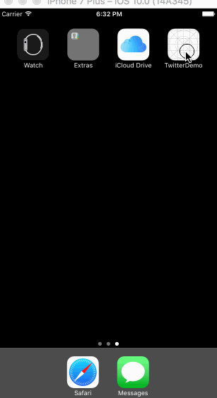

# Project 4 - *Twitter*

Time spent: **18** hours spent in total

## User Stories

The following **required** functionality is completed:

- [x] Hamburger menu
   - [x] Dragging anywhere in the view should reveal the menu.
   - [x] The menu should include links to your profile, the home timeline, and the mentions view.
   - [x] The menu can look similar to the example or feel free to take liberty with the UI.
- [x] Profile page
   - [x] Contains the user header view
   - [x] Contains a section with the users basic stats: # tweets, # following, # followers
- [x] Home Timeline
   - [x] Tapping on a user image should bring up that user's profile page

The following **optional** features are implemented:

- [ ] Profile Page
   - [ ] Implement the paging view for the user description.
   - [ ] As the paging view moves, increase the opacity of the background screen. See the actual Twitter app for this effect
   - [ ] Pulling down the profile page should blur and resize the header image.
- [ ] Account switching
   - [ ] Long press on tab bar to bring up Account view with animation
   - [ ] Tap account to switch to
   - [ ] Include a plus button to Add an Account
   - [ ] Swipe to delete an account

The following **additional** features are implemented:

- [ ] List anything else that you can get done to improve the app functionality!

Please list two areas of the assignment you'd like to **discuss further with your peers** during the next class (examples include better ways to implement something, how to extend your app in certain ways, etc):

  1. I've ran into an issue for the profile view, where I'd like the scroll to scroll both the table view and the profile header. In the real twitter app, when you scroll, the header shrinks back into the top layout, then if you keep scrolling, the table view would then scroll.
  2. Is there a better way of creating subviews? I've noticed that there is a prebuilt container view object that you can insert into the storyboard.  Is there a difference between the method in Tim's video vs using the swift container view?

## Video Walkthrough

Here's a walkthrough of implemented user stories:

[TwitterGif](http://i.imgur.com/I4c5lEe.gifv)

GIF created with [LiceCap](http://www.cockos.com/licecap/).

## Notes

Describe any challenges encountered while building the app.

## License

    Copyright [2016] [Edwin Wong]

    Licensed under the Apache License, Version 2.0 (the "License");
    you may not use this file except in compliance with the License.
    You may obtain a copy of the License at

        http://www.apache.org/licenses/LICENSE-2.0

    Unless required by applicable law or agreed to in writing, software
    distributed under the License is distributed on an "AS IS" BASIS,
    WITHOUT WARRANTIES OR CONDITIONS OF ANY KIND, either express or implied.
    See the License for the specific language governing permissions and
    limitations under the License.